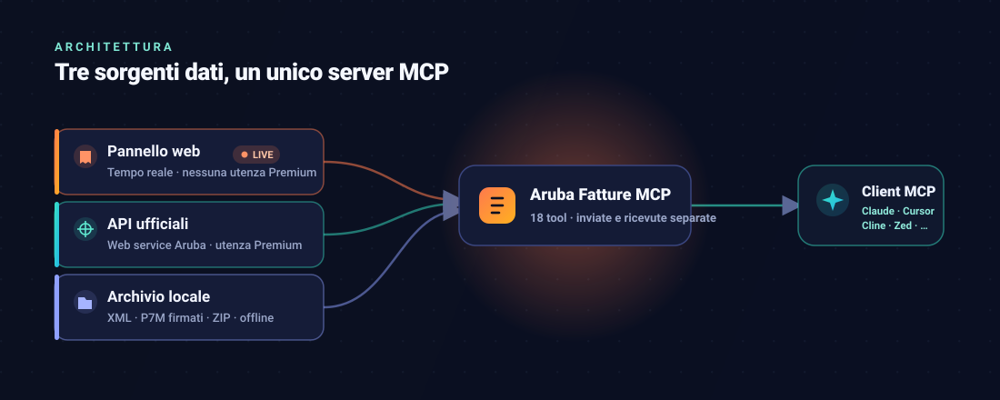

<p align="center">
  
</p>

<p align="center">
  <a href="https://modelcontextprotocol.io"></a>
  
  
  
  
</p>

<h1 align="center">Aruba Fatture MCP</h1>

<p align="center">
  <b>Fatturazione Elettronica Aruba per qualsiasi client MCP.</b><br>
  Fatture inviate e ricevute, clienti e fornitori, statistiche IVA e creazione fatture — in tempo reale, anche senza utenza Premium.
</p>

Server [Model Context Protocol](https://modelcontextprotocol.io) che porta la **Fatturazione Elettronica di Aruba** dentro qualsiasi client MCP — Claude (Code e Desktop), Cursor, Cline, Zed e gli altri. Interroghi e crei fatture elettroniche (FatturaPA / SDI) in linguaggio naturale: «quanto ho fatturato quest'anno?», «prospetto IVA del trimestre», «chi sono i miei fornitori principali?», «genera la fattura per questo cliente».

Documentazione API ufficiali Aruba: <https://fatturazioneelettronica.aruba.it/apidoc/v2/docs.html>

Il server ha **tre sorgenti dati indipendenti**:

- **Pannello web (live)** — legge le fatture direttamente dal pannello Aruba in tempo reale, **senza utenza Premium**. È la sorgente consigliata per liste, clienti/fornitori, IVA e statistiche;
- **API Aruba ufficiali** — dati in tempo reale dal web service, ma richiedono un'utenza **Premium** (o delegata da una Premium);
- **archivio locale** — analisi sugli XML/ZIP esportati a mano, utile offline o come backup.

In tutte le sorgenti, **fatture inviate (ciclo attivo) e ricevute (ciclo passivo) sono sempre tenute separate**: nessun tool le somma o le mischia.

## Tool sul pannello web (live, nessuna utenza Premium)

Accedono al pannello con le stesse credenziali del login web, replicandone l'API interna. Non serve esportare nulla: i dati sono sempre aggiornati.

| Tool | Descrizione |
|---|---|
| `panel_list_invoices` | Elenco fatture di **un** ciclo (`inviate` **o** `ricevute`), con filtri per periodo e controparte e i totali |
| `panel_invoice_detail` | Dettaglio di una singola fattura (metadati + righe + riepilogo IVA); può salvare XML e PDF su disco |
| `panel_counterparties` | Clienti (dalle inviate) **o** fornitori (dalle ricevute), con totali e periodo di attività |
| `panel_registry` | Registro anagrafico salvato in Aruba: clienti **o** fornitori, con P.IVA, codice fiscale, codice destinatario e indirizzo |
| `panel_vat_report` | Totali IVA dell'anno: IVA vendite e IVA acquisti separate, con il saldo |
| `panel_revenue_trend` | Andamento per mese/trimestre/anno, inviate e ricevute in due serie distinte |
| `panel_create_invoice_xml` | Genera l'XML di una nuova fattura scegliendo il cliente dal registro Aruba; calcola i totali. Non invia |
| `panel_upload_invoice` | Carica un XML nel pannello creando una **bozza** pronta da rivedere e inviare. Non invia a SDI |

Ogni tool di elenco/anagrafica richiede il parametro `ciclo` (o `tipo`) proprio per non mescolare mai i due flussi. I dati dell'anno vengono scaricati una volta e messi in cache; `ricarica: true` forza il riscaricamento.

### Creare e inviare una fattura

Il flusso è pensato per essere sicuro rispetto all'unica azione irreversibile — l'invio a SDI:

1. `panel_registry` con `tipo: "clienti"` per trovare il destinatario (o si conosce già la sua P.IVA);
2. `panel_create_invoice_xml` genera l'XML: i dati del mittente sono riusati da una fattura già emessa (sempre corretti), il destinatario dal registro Aruba, e i totali IVA sono calcolati dalle righe. Restituisce il file e i totali da verificare;
3. `panel_upload_invoice` carica l'XML nel pannello come **bozza**.

**L'invio a SDI non è automatizzato di proposito.** È un'azione irreversibile e, su questo account, Aruba richiede un **OTP via SMS** per completarla (`jsAbilitaOtpCaricaFattura`). Dopo l'upload, la bozza va rivista e inviata dal pannello web. È una tutela voluta: nessun tool può far partire una fattura reale senza un passaggio umano.

> Questi tool usano l'**API privata del pannello**, non documentata da Aruba: è più comoda (nessun requisito di utenza) ma può cambiare senza preavviso. Per l'accesso ufficiale e stabile restano i tool «API Aruba» qui sotto, che però richiedono un'utenza Premium.

## Tool sulle API Aruba

| Tool | Descrizione | Utenza richiesta |
|---|---|---|
| `get_user_info` | Informazioni account (P.IVA, stato servizio, spazio conservazione) | base |
| `get_invoice_notifications` | Notifiche SDI di una fattura per nome file (consegna, scarto, esiti) | base¹ |
| `send_invoice` | Invia una fattura XML a SDI — di default `dryRun=true` (solo validazione) | **Premium** |
| `search_invoices` | Ricerca fatture inviate o ricevute per periodo, stato, controparte | **Premium** |
| `get_invoice_detail` | Metadati completi di una fattura (per `id`, `filename` o `idSdi`) | **Premium** |
| `download_invoice` | Salva su disco XML, PDF, ZIP (fattura + notifiche) o PDD | **Premium** |

Le utenze **base** standalone non hanno le deleghe API (`FAW-*`): ricerca e dettaglio rispondono 401 (`delega FAW-R non presente` per le inviate, `FAW-IN` per le ricevute), l'upload risponde `0093 Errore deleghe` — ma solo **dopo** aver superato la validazione XSD, quindi un errore `0092` su upload non implica che l'invio sia abilitato. ¹L'endpoint notifiche risponde a livello dati con utenza base (verificato con `errorCode 0002`), ma non è stato possibile verificarlo con una fattura esistente.

> Attenzione: il controllo delle deleghe avviene **dopo** la validazione dei parametri. Una richiesta con una finestra date superiore a 10 giorni risponde 400 anche a un'utenza senza deleghe: per sapere se le deleghe ci sono, interrogare con una finestra valida.

## Tool sull'archivio locale

Funzionano su una cartella di fatture esportate dal pannello Aruba (o da qualunque altro portale SDI) e **non richiedono utenza Premium**. Formati riconosciuti, anche in sottocartelle: `.xml`, `.p7m` (firmate CAdES) e `.zip` che li contengono. I duplicati — stesso emittente, numero e data — vengono unificati.

| Tool | Descrizione |
|---|---|
| `list_invoices` | Elenco fatture filtrabile per direzione, periodo, controparte, tipo documento e importo, con i totali del sottoinsieme |
| `list_counterparties` | Anagrafica clienti e fornitori ricostruita dalle fatture, con numero documenti, totali e periodo di attività |
| `vat_report` | Prospetto IVA del periodo: imponibile e imposta per aliquota e natura, separando vendite e acquisti, con il saldo |
| `revenue_trend` | Andamento di fatturato e acquisti per mese, trimestre o anno |

La direzione (emessa/ricevuta) è determinata confrontando il cedente della fattura con la partita IVA e il codice fiscale del titolare, letti automaticamente da `get_user_info` (con fallback a `ARUBA_VAT_CODE` / `ARUBA_FISCAL_CODE` se l'account non è raggiungibile).

`vat_report` è un prospetto contabile di supporto, **non una liquidazione IVA**: non tiene conto di detraibilità parziale, reverse charge, split payment o crediti pregressi.

## Requisiti

- Node.js ≥ 18
- Credenziali del servizio Aruba Fatturazione Elettronica

## Installazione

```bash
npm install
npm run build
```

## Configurazione

| Variabile | Descrizione |
|---|---|
| `ARUBA_USERNAME` | Username del servizio Fatturazione Elettronica |
| `ARUBA_PASSWORD` | Password del servizio |
| `ARUBA_ENVIRONMENT` | `demo` (default) oppure `production` |
| `ARUBA_ARCHIVE_DIR` | Cartella con gli XML/ZIP delle fatture, usata dai tool di analisi quando non si passa `archivePath` |
| `ARUBA_VAT_CODE` | Facoltativa: P.IVA del titolare, solo come fallback se `get_user_info` non è raggiungibile |
| `ARUBA_FISCAL_CODE` | Facoltativa: codice fiscale del titolare, stesso scopo |

Le credenziali non vanno messe in file versionati: `.env` è già in `.gitignore`.

L'ambiente `demo` usa i server di test Aruba (`demoauth`/`demows`): consigliato per le prime prove.

### Collegare il server a un client MCP

Il server parla `stdio` ed è compatibile con qualunque client MCP. La configurazione è sempre la stessa — comando `node <percorso>/dist/index.js` con le variabili d'ambiente qui sopra. Sotto due esempi (Claude Code e Claude Desktop); per **Cursor**, **Cline**, **Zed** e gli altri vale lo stesso schema `command`/`args`/`env` nel rispettivo file di configurazione MCP.

#### Claude Code

```bash
claude mcp add aruba-fatture ^
  -e ARUBA_USERNAME=tuo_username ^
  -e ARUBA_PASSWORD=tua_password ^
  -e ARUBA_ENVIRONMENT=demo ^
  -- node <percorso-del-progetto>\dist\index.js
```

#### Claude Desktop

In `claude_desktop_config.json` (o nel file MCP equivalente di Cursor/Cline/Zed):

```json
{
  "mcpServers": {
    "aruba-fatture": {
      "command": "node",
      "args": ["<percorso-del-progetto>\\dist\\index.js"],
      "env": {
        "ARUBA_USERNAME": "tuo_username",
        "ARUBA_PASSWORD": "tua_password",
        "ARUBA_ENVIRONMENT": "demo"
      }
    }
  }
}
```

## Note operative

- **Invio a SDI**: `send_invoice` per default esegue solo la validazione (`dryRun=true`). L'invio reale avviene solo chiedendo esplicitamente di impostare `dryRun=false`.
- **Trasmittente**: le fatture inviate tramite Aruba devono riportare l'intermediario Aruba nell'`IdTrasmittente` (P.IVA `01879020517`).
- **Codice destinatario** per ricevere fatture su Aruba: `KRRH6B9`.
- **Rate limit Aruba**: 12 richieste/minuto per le ricerche, 30/minuto per gli upload; oltre soglia il server restituisce HTTP 429. Anche l'endpoint di autenticazione è soggetto a rate limit severi: il client serializza i login e riusa i token proprio per questo — in caso di 429 sull'autenticazione attendere qualche minuto.
- I contenuti base64 (XML/PDF) vengono omessi dalle risposte testuali per non saturare il contesto: usare `download_invoice` per salvarli su file.
- I token di accesso (30 min) e di refresh (60 min) sono gestiti automaticamente.

## Architettura

<p align="center">
  
</p>

Il codice è organizzato per sorgente dati, in modo che i tre canali restino indipendenti.

| File | Ruolo |
|---|---|
| `src/index.ts` | Server MCP: registra tutti i tool e li instrada alla sorgente giusta |
| `src/panel-client.ts` | Login headless al pannello (OpenID Connect) e chiamate all'API interna `/services/*` |
| `src/panel.ts` | Normalizzazione e aggregazione dei dati del pannello (inviate/ricevute separate) |
| `src/aruba-client.ts` | Client delle API ufficiali (OAuth2 password/refresh, gestione token) |
| `src/archivio.ts` | Lettura di un archivio locale di `.xml`/`.p7m`/`.zip`, con classificazione emesse/ricevute |
| `src/fatturapa.ts` | Parser FatturaPA v1.2.x da XML a struttura tipizzata |
| `src/analisi.ts` | Aggregazioni sull'archivio locale (liste, controparti, IVA per aliquota, andamento) |

### Come funziona la modalità pannello (live)

Il pannello web di Aruba non espone API documentate, ma la sua interfaccia parla con un backend REST interno (`/services/*`) dietro un login **OpenID Connect (Keycloak)**. Il client replica il flusso di login del browser senza browser:

1. `GET /api/oauth2/authorization/gateway` → il gateway reindirizza a Keycloak e imposta il cookie di sessione;
2. si legge la pagina di login Keycloak e se ne estrae l'`action` del form;
3. `POST` di username e password all'`action` → risposta con l'`authorization code` (il reCAPTCHA della pagina non è imposto lato server);
4. il ritorno del `code` al gateway stabilisce la sessione applicativa.

Da qui le chiamate `/services/*` usano il cookie di sessione più gli header applicativi `aru-sub`, `aru-delegator` e `X-Requested-With` che il pannello aggiunge. Il login viene serializzato e la sessione riusata; alla scadenza (401) si rifà il login e si ritenta una volta. I dati dell'anno sono scaricati una volta e messi in cache in memoria.

> È un'API **privata e non documentata**: funziona con qualunque utenza (nessun requisito Premium) ma Aruba può cambiarla senza preavviso. In quel caso restano operative le altre due sorgenti.

## Validazione XSD locale

In `test/` c'è una fattura di esempio e gli schemi XSD ufficiali FatturaPA v1.2.2. Per validare un XML senza passare dall'API (equivalente strutturale del `dryRun`):

```bash
pip install xmlschema
python -c "import xmlschema; s = xmlschema.XMLSchema('test/xsd/fatturapa.xsd', locations={'http://www.w3.org/2000/09/xmldsig#': 'test/xsd/xmldsig-core-schema.xsd'}); s.validate('test/esempio-fattura.xml'); print('VALIDA')"
```

## Esempi di richieste (pannello live)

- «Quanto ho fatturato quest'anno? E quanto ho speso in acquisti?»
- «Fammi il prospetto IVA del 2026»
- «Elenca le fatture inviate di luglio»
- «Chi sono i miei fornitori principali?»
- «Ci sono fatture inviate scartate da SDI?»
- «Confronta fatturato e acquisti trimestre per trimestre»

## Come popolare l'archivio locale

Dal pannello Aruba Fatturazione Elettronica, sezione fatture inviate/ricevute, si esportano i documenti del periodo in ZIP. Basta salvare gli ZIP (senza scompattarli) in una cartella e puntarci `ARUBA_ARCHIVE_DIR`: i tool di analisi leggono direttamente il contenuto.

Con un'utenza Premium lo stesso archivio si popola via API con `download_invoice` in formato `zip`.

## Esempi di richieste

Sulle API (utenza Premium):

- «Cerca le fatture ricevute la settimana scorsa»
- «Ci sono fatture scartate da SDI a luglio? Mostrami il motivo dello scarto»
- «Scarica il PDF della fattura IT01234567890_00042 in C:\fatture»
- «Valida questo XML prima dell'invio» (usa `send_invoice` con `dryRun=true`)

Sull'archivio locale (qualsiasi utenza):

- «Quanto ho fatturato nel secondo trimestre?»
- «Fammi il prospetto IVA da gennaio a giugno»
- «Chi sono i miei 10 clienti principali per fatturato?»
- «Mostrami le fatture ricevute sopra i 1.000 euro»
- «Confronta il fatturato mese per mese di quest'anno»
